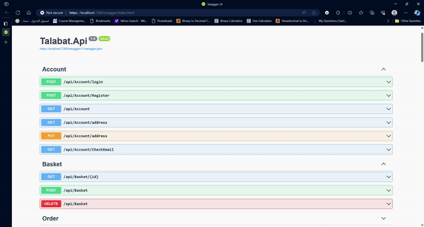

# ASP.NET Project for E-Commerce

This repository hosts the source code for an advanced ASP.NET Core API tailored for e-commerce applications. The API offers comprehensive functionalities including product management, order processing, user authentication, and payment integration. It adheres to RESTful principles to ensure seamless integration with various client applications. Detailed documentation is provided to assist developers in leveraging the full capabilities of the API.

## Key Components and Technologies

- **RESTful APIs**  
  The API is designed following RESTful principles, ensuring efficient communication and interoperability with client applications. This design promotes scalability and ease of integration.

- **Onion Architecture**  
  The project is structured using the Onion Architecture pattern, which enhances maintainability, scalability, and separation of concerns. This architectural style divides the application into distinct layers, each with its own responsibility, facilitating easier testing and modification.

- **Unit of Work and Specification Design Pattern**  
  - **Unit of Work:** Ensures efficient management of database transactions, promoting consistency and atomicity.
  - **Specification Pattern:** Encapsulates business logic into reusable and composable specifications, enabling flexible and maintainable querying capabilities.

- **Pagination**  
  Implemented pagination to efficiently handle large datasets, improving both performance and user experience during data retrieval operations.

- **Redis Caching**  
  Utilized Redis for caching to enhance application performance. By storing frequently accessed data in-memory, Redis reduces database load and latency, resulting in faster response times and improved scalability.

- **Identity and JWT for Authorization**  
  - **ASP.NET Identity:** Provides robust user authentication and management.
  - **JSON Web Tokens (JWT):** Implements stateless authentication, allowing secure and efficient authorization across distributed systems.

- **Stripe for Payment Processing**  
  Integrated Stripe's payment gateway to handle secure transactions seamlessly. Stripe ensures reliable payment processing while maintaining high standards of PCI compliance and data security.

- **Controllers**  
  The API consists of five primary controllers, each responsible for specific operations:
  - **Basket Controller:** Manages shopping baskets and cart-related functionalities.
  - **Account Controller:** Handles user account management and authentication.
  - **Order Controller:** Manages order processing and lifecycle.
  - **Payment Controller:** Facilitates payment processing and transaction management.
  - **Products Controller:** Oversees product-related operations and management.

## Getting Started

To get started with this project, please refer to the [documentation](./docs) for setup instructions, API usage guidelines, and detailed feature descriptions.

## Contributing

We welcome contributions! Please review our [contribution guidelines](./CONTRIBUTING.md) before submitting pull requests.

## License

This project is licensed under the MIT License. See the [LICENSE](./LICENSE) file for more details.
